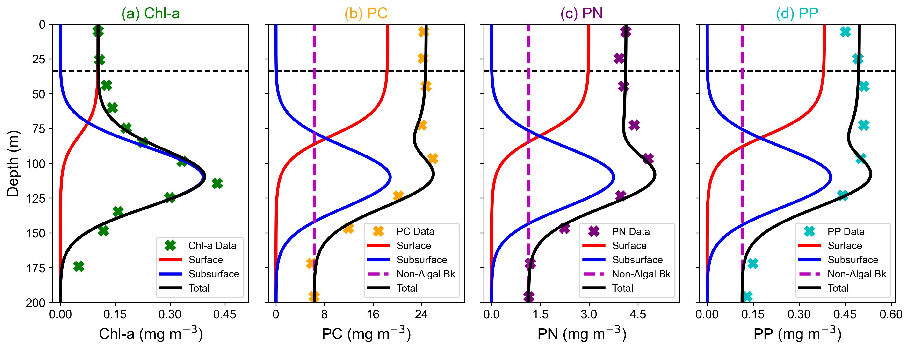

# HOT_TwoCommunityModel_Stoichiometry_Method

Code used for the submitted paper "Two‑Layer Vertical Partitioning of Phytoplankton Biomass and Stoichiometry in the North Pacific Subtropical Gyre" by Viljoen et al. available as a preprint at [https://doi.org/10.22541/essoar.176833284.46229776/v1](https://doi.org/10.22541/essoar.176833284.46229776/v1).

The majority of HOT data for Station ALOHA used in this study were obtained via the HOT-DOGS application.

Each script contains a short description at the start.

## Example Model Fit

   
  <em>Figure 1 in Viljoen et al. Preprint.</em>

## Citation

If you use this code, please cite:

Viljoen, J. J. (2025). Code used for the paper: Two‑Layer Vertical Partitioning of Phytoplankton Biomass and Stoichiometry in the North Pacific Subtropical Gyre (Version v1). Zenodo. https://doi.org/10.5281/zenodo.17987561

## License

This repository is licensed under the [GNU General Public License v3.0](LICENSE), ensuring that the software remains free and open, with the source code available for transparency and modification.
